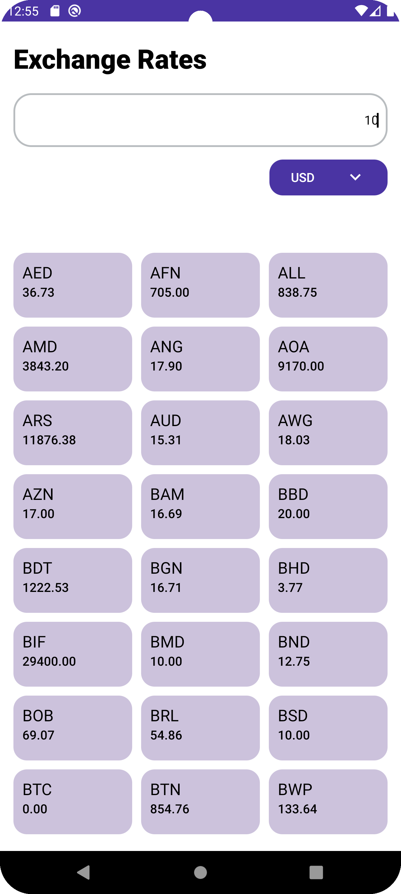
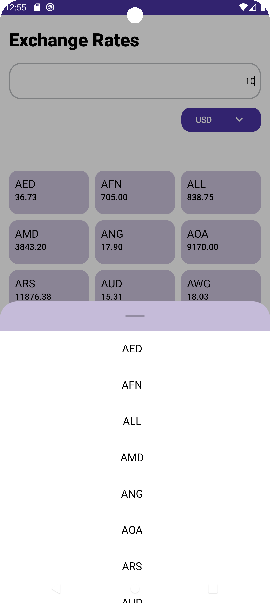
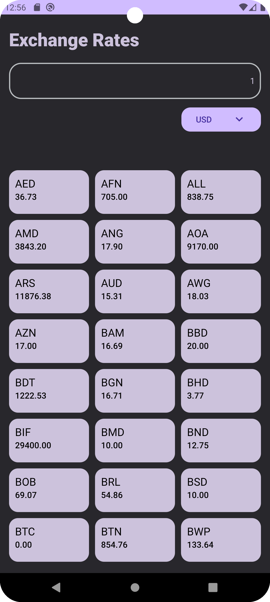
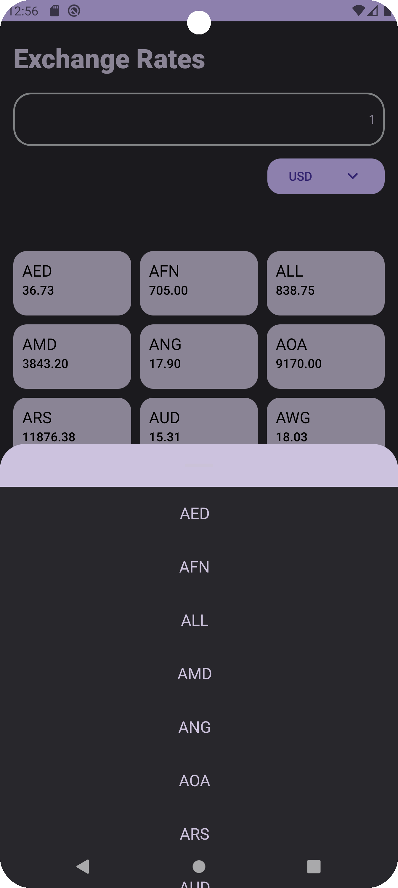
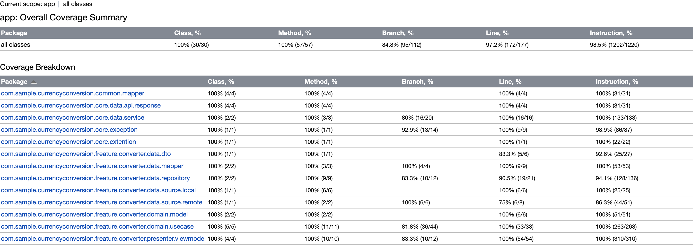

# 💱 Currency Converter App  

A modern Android currency conversion app built with **Kotlin, Clean Architecture, and Jetpack Compose**, fetching real-time exchange rates from [OpenExchangeRates](https://openexchangerates.org/).  

## 📸 Screenshots  

### Light Theme
<div align="center">
  
    
</div>

### Dark Theme  
<div align="center">
  
  
</div>

**Unit Test Coverage**  
  

## 🛠 Tech Stack  
- **Language**: Kotlin  
- **Architecture**: Clean Architecture (MVVM)  
- **DI**: Koin  
- **Networking**: Retrofit + OkHttp  
- **UI**: Jetpack Compose  
- **Testing**: JUnit, Mockito, Compose UI Tests  

## ✨ Features  
- Convert currencies using real-time exchange rates.  
- Change base currency (default: USD).  
- Dark/Light theme support.  
- 95%+ Unit test coverage (Kover).  
- Fully tested UI with Jetpack Compose.  

## 🚀 Setup  
1. Get a **free API key** from [OpenExchangeRates](https://openexchangerates.org/signup).  
2. Add the key to `secret.properties` in the `assets` folder:  

```properties
# 🔒 Add your API key here  
API_KEY="your_api_key_here"  
